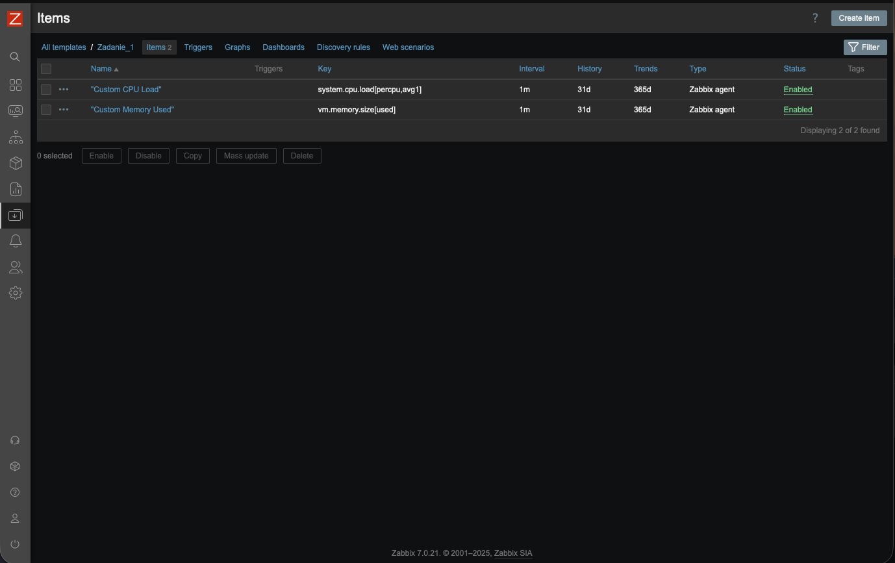
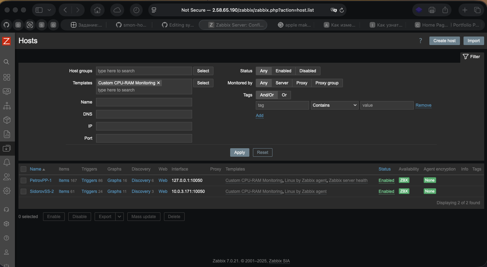
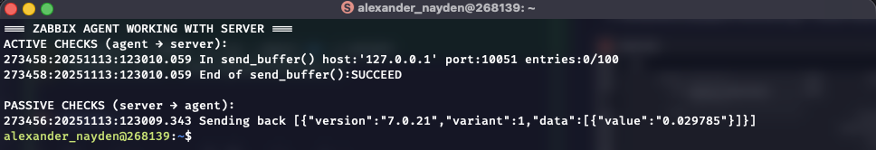
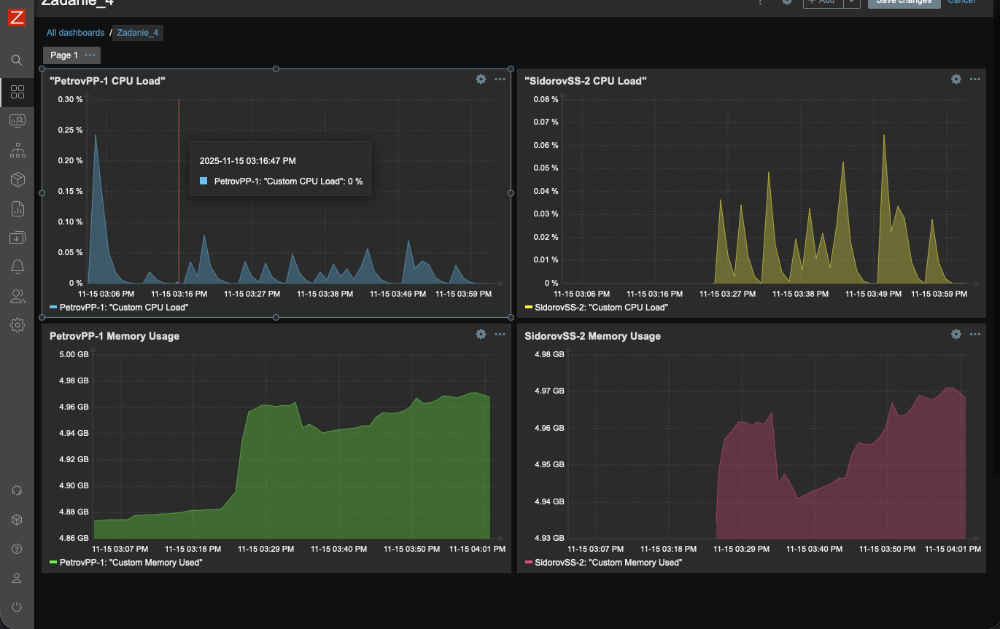

# Домашнее задание к занятию "`Система мониторинга Zabbix`" - `Найден Александр`

## Задание 1

### 1. Screenshot авторизации в админке.




### 2. Использованные команды.

```bash
# Подготовка системы
sudo apt update && sudo apt upgrade -y

# Установка PostgreSQL
sudo apt install -y postgresql postgresql-contrib
sudo systemctl status postgresql
sudo systemctl enable postgresql

# Установка репозитория Zabbix
sudo apt install -y wget curl gnupg2 ca-certificates lsb-release debian-archive-keyring
wget https://repo.zabbix.com/zabbix/7.0/debian/pool/main/z/zabbix-release/zabbix-release_7.0-1+debian12_all.deb
sudo dpkg -i zabbix-release_7.0-1+debian12_all.deb
sudo apt update

# Установка Zabbix
sudo apt install -y zabbix-server-pgsql zabbix-frontend-php php8.2-pgsql zabbix-apache-conf zabbix-sql-scripts zabbix-agent

# Настройка БД
sudo -u postgres psql
CREATE USER zabbix WITH PASSWORD 'zabbix';
CREATE DATABASE zabbix OWNER zabbix;
\q

sudo zcat /usr/share/zabbix-sql-scripts/postgresql/server.sql.gz | sudo -u zabbix psql zabbix

# Настройка Zabbix Server
sudo nano /etc/zabbix/zabbix_server.conf
# DBHost=localhost
# DBName=zabbix
# DBUser=zabbix
# DBPassword=zabbix

# Настройка PHP
sudo nano /etc/php/8.2/apache2/php.ini
# date.timezone = Europe/Moscow

# Запуск служб
sudo systemctl restart apache2
sudo systemctl enable zabbix-server zabbix-agent apache2
sudo systemctl start zabbix-server zabbix-agent

# Настройка firewall
sudo iptables -A INPUT -p tcp --dport 80 -j ACCEPT
sudo iptables-save > /etc/iptables/rules.v4
```

## Задание 2

### 1. Screenshot раздела Configuration > Hosts.




### 2. Screenshot лога zabbix agent.




### 3. Screenshot раздела Monitoring > Latest data для обоих хостов.



### 4. Использованные команды.

```bash
# ==============================================
# ПРОСМОТР ЛОГОВ ZABBIX AGENT И ПРОВЕРКА РАБОТЫ С СЕРВЕРОМ
# ==============================================

# Просмотр логов в реальном времени (основная команда)
sudo tail -f /var/log/zabbix/zabbix_agentd.log

# Просмотр последних 30 строк логов
sudo tail -n 30 /var/log/zabbix/zabbix_agentd.log

# Просмотр логов с фильтром по работе с сервером
sudo tail -n 50 /var/log/zabbix/zabbix_agentd.log | grep -E "(server|active|sending)"

# Поиск активных проверок (агент → сервер)
sudo grep -E "send_buffer|sending to" /var/log/zabbix/zabbix_agentd.log

# Поиск пассивных проверок (сервер → агент)
sudo grep -E "Requested|Sending back" /var/log/zabbix/zabbix_agentd.log

# Проверка статуса службы Zabbix Agent
sudo systemctl status zabbix-agent

# Перезапуск агента (после изменения конфигурации)
sudo systemctl restart zabbix-agent

# Тестирование подключения к агенту (должен вернуть 1)
zabbix_get -s 127.0.0.1 -k agent.ping

# Проверка версии агента
zabbix_get -s 127.0.0.1 -k agent.version

# Просмотр основных настроек агента
sudo cat /etc/zabbix/zabbix_agentd.conf | grep -E "(Hostname|Server|ServerActive|DebugLevel)"

# Редактирование конфигурации агента
sudo nano /etc/zabbix/zabbix_agentd.conf

# Просмотр логов сервера Zabbix
sudo tail -f /var/log/zabbix/zabbix_server.log

# Проверка, слушает ли агент порт 10050
sudo netstat -tlnp | grep 10050

# Проверка доступности сервера на порту 10051
telnet 127.0.0.1 10051

# Команда для красивого скриншота логов
clear && echo "=== Zabbix Agent Logs - Server Communication ===" && sudo tail -n 20 /var/log/zabbix/zabbix_agentd.log | grep -E "(send_buffer|Requested|Sending back)"

# Компактный вариант для демонстрации работы с сервером
clear && echo "=== Active Connection to Server ===" && sudo tail -n 15 /var/log/zabbix/zabbix_agentd.log | grep -E "(sending to|active checks.*getting list)"
```

