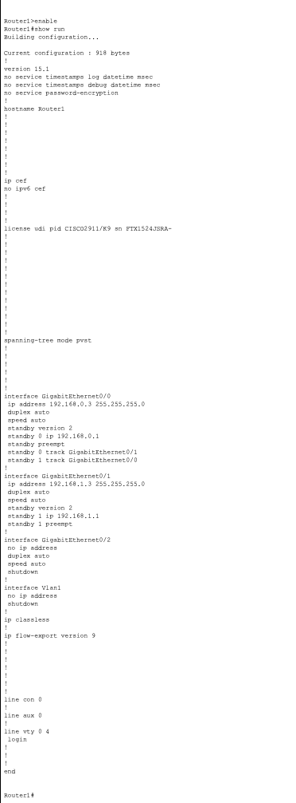
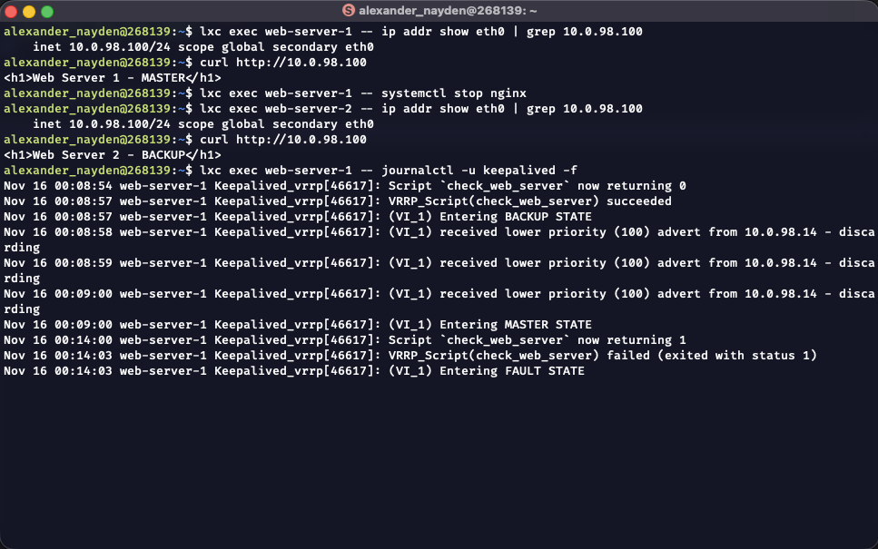

# Домашнее задание к занятию "`Домашнее задание к занятию 1 «Disaster recovery и Keepalived»`" - `Найден Александр`

## Задание 1

####

#### 

####

- Файл [hsrp_advanced.pkt](hsrp_advanced.pkt)

####

## Задание 2

- Файл [check_web_server.sh](check_web_server.sh)

- Файл [keepalived.conf](keepalived.conf)

####

