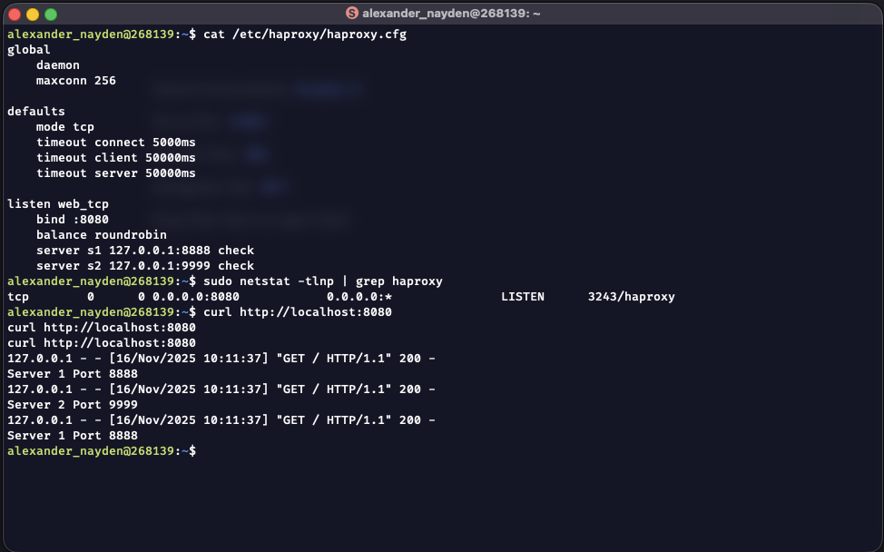
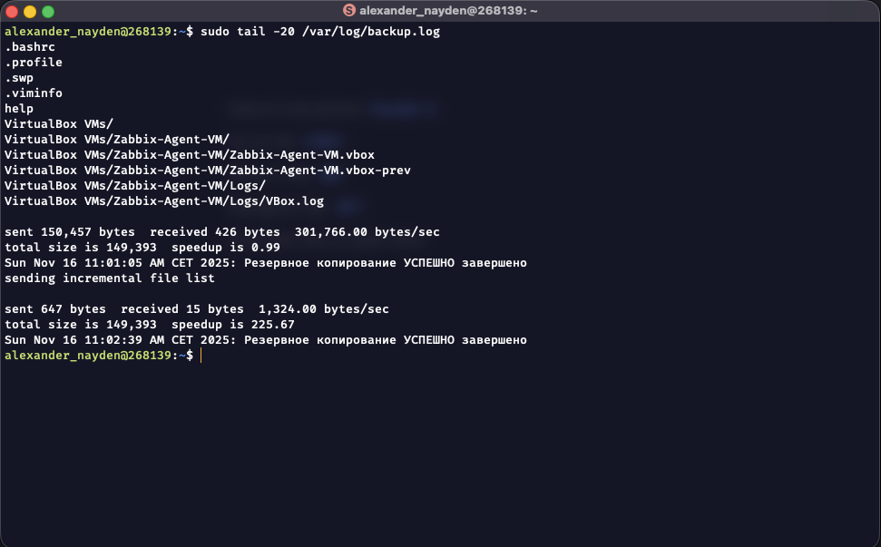

# Домашнее задание к занятию "`Резервное копирование`" - `Найден Александр`

## Задание 1

```bash
# Создание резервной копии домашней директории
rsync -avc --delete --exclude='.*/' $HOME/ /tmp/backup/
```

####




## Задание 2



####

- Файл [crontab](crontab)

####

- Файл [backup_script.sh](backup_script.sh)
